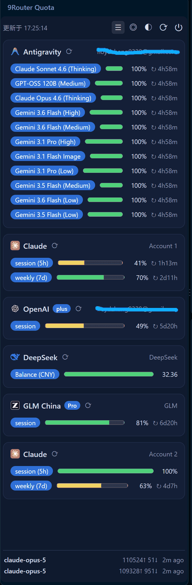
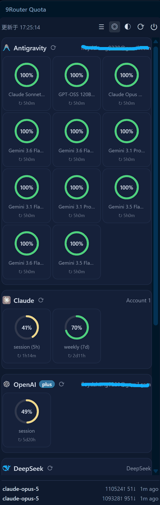
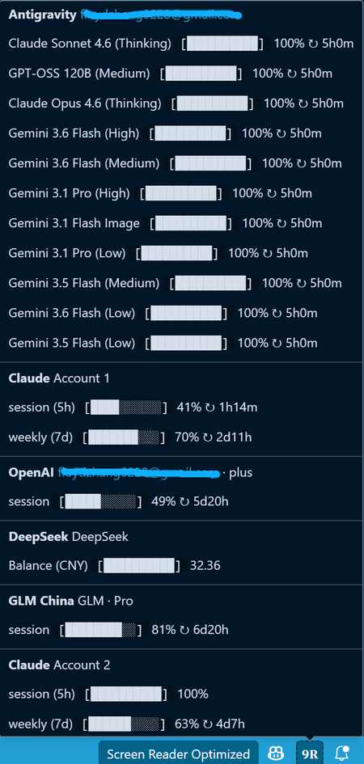

# 9Router Quota

在 VSCode 里查看 [9Router](https://github.com/decolua/9router) 各 AI 账号配额用量的客户端扩展。

## 一、工程简介

### 1. 项目背景

9Router 是一个 AI 服务聚合网关，可接入 Claude、OpenAI、Gemini、DeepSeek 等多家供应商账号。本工程为其配套的配额监控客户端，当前提供 VSCode 扩展形态，方便在编辑器内实时掌握各账号的剩余配额与请求动态。9Router 服务端的部署请参考其官方仓库：[decolua/9router](https://github.com/decolua/9router)（含 Docker 一键部署与配置说明）。

### 2. 运行截图

截图素材统一放在 `packages/vscode-extension/images/`（要随 vsix 打包给扩展详情页用），这里直接引用同一份，不另存一套。

<1> 侧边栏面板 · 列表视图（进度条 + 剩余百分比 + 重置倒计时，底部为实时最近请求）：



<2> 侧边栏面板 · 圆环视图（同一份数据的紧凑排布，适合账号配额条目较多时速览）：



<3> 状态栏悬浮配额卡片（悬停右下角 `9R` 图标）：



### 3. 功能特性

<1> 活动栏侧边栏面板：分组卡片展示各账号配额，支持列表/圆环双视图切换。

<2> 状态栏指示：右下角常驻 `9R` 图标，悬浮显示配额摘要卡片（账号分段 + 进度条 + 剩余百分比/余额 + 重置倒计时），每 5 分钟自动刷新。

<3> 实时最近请求：面板底部状态条通过 SSE 长连接实时推送最近两条请求（模型、输入/输出 token、相对时间），无需手动刷新。

<4> 单账号刷新：每个账号卡片带独立刷新按钮，可单独重拉该账号数据。

<5> 主题切换：深色 / 浅色 / 跟随 VSCode 主题三档循环切换，偏好跨会话保留。

<6> 余额型配额直读：DeepSeek 等信用池类账号直接显示真实余额数字而非百分比。

### 4. 配置与登录

<1> 首次使用：打开 VSCode 左侧活动栏的 `9R` 图标，在面板中填入 9Router 服务地址（如 `http://9router.example.com`）与 Dashboard 密码。

<2> 密码存储：密码仅保存在 VSCode 本地凭据库（SecretStorage），不同步、不明文落盘。

<3> 服务地址也可通过设置项 `9routerQuota.baseUrl` 预先配置。

### 5. 目录结构

```
packages/
  core/               平台无关核心逻辑：登录、拉取账号/配额、SSE 流式订阅、
                      文案格式化。纯 TypeScript + 原生 fetch，不依赖平台 API，
                      供各端复用或移植。
  vscode-extension/   VSCode 扩展客户端：活动栏面板 + 状态栏悬浮卡片。
    media/            面板前端资源（app.js / style.css / 各供应商 logo）。
    images/           README 截图，随 vsix 打包，供扩展详情页显示。
    .github/          （仓库级）CI 工作流：tag 触发自动打包发布。
```

### 6. 技术栈

① TypeScript + esbuild：core 与扩展均为 TS,esbuild 打包无框架依赖。

② 原生 VSCode Webview API:面板为自制 HTML/CSS/JS,不引入 React 等前端框架。

③ 原生 fetch + SSE:与 9Router 服务端交互零第三方 HTTP 库。

## 二、本地编译打包

### 1. 前置条件

<1> Node.js ≥ 20 及随附的 npm。

<2> 一个运行中的 9Router 服务实例及其 Dashboard 密码。

### 2. 安装与构建

① 安装依赖（仓库根目录执行）：

```bash
npm install
```

② 构建全部包：

```bash
npm run build
```

该命令依次执行：core 的 `tsc` 编译 → 扩展的 `esbuild` 打包。

### 3. 开发调试

用 VSCode 打开 `packages/vscode-extension` 目录，按 F5 启动扩展开发宿主即可调试。

### 4. 本地打包 vsix

```bash
cd packages/vscode-extension
npx @vscode/vsce package --no-dependencies
```

产物为当前目录下的 `9router-quota-<版本号>.vsix`。

### 5. 本地安装 vsix

```bash
code --install-extension 9router-quota-<版本号>.vsix
```

或在 VSCode 命令面板执行 `Extensions: Install from VSIX...` 选择文件。

## 三、GitHub 上编译打包与分发

本扩展通过 GitHub Release 分发 vsix，不上架 VSCode Marketplace（上架需 Azure DevOps 组织，而创建组织已强制要求绑定 Azure 订阅）。

### 1. 工作流说明

仓库内置 `.github/workflows/release.yml`：推送 `v` 开头的 SemVer tag（如 `v0.2.0`）时自动触发，流程为拉取代码 → `npm ci` → 构建 core → 从 tag 同步扩展 manifest 版本 → `vsce package` 打包 → 校验 VSIX 文件名版本 → 创建 GitHub Release 并上传附件。

### 2. 发布步骤

① 提交并推送代码至 `master`：

```bash
git add -A && git commit -m "..." && git push origin master
```

② 打 tag 并推送（无需手动修改 `package.json` 的 `version`）：

```bash
git tag v<版本号>
git push origin v<版本号>
```

例如 `v0.2.0` 会自动产出 `9router-quota-0.2.0.vsix`。版本同步只发生在 GitHub Actions 的临时工作区，不会回写仓库。

③ 到仓库 Actions 页确认 Release 工作流执行成功，Releases 页即可下载 vsix。

### 3. 注意事项

<1> tag 必须符合 `v<SemVer>` 格式（如 `v0.2.0`）；非法格式会在版本同步步骤直接失败。

<2> 相同版本号不应重复打 tag；发布失败修复后应 bump 版本号再发。

<3> 打包在干净环境进行，`packages/core` 会由工作流先构建，无需提交 `dist/` 产物。

### 4. 用户安装方式

从仓库 [Releases](https://github.com/FloydZhang0228/9Router-Quota/releases) 页下载对应版本的 `.vsix`，然后：

```bash
code --install-extension 9router-quota-<版本号>.vsix
```

或在 VSCode 命令面板执行 `Extensions: Install from VSIX...` 选择文件。

