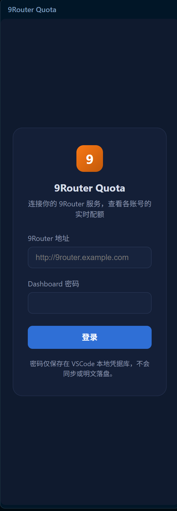
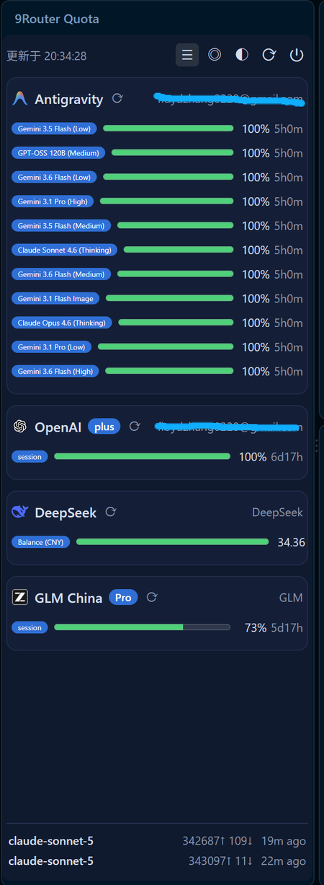
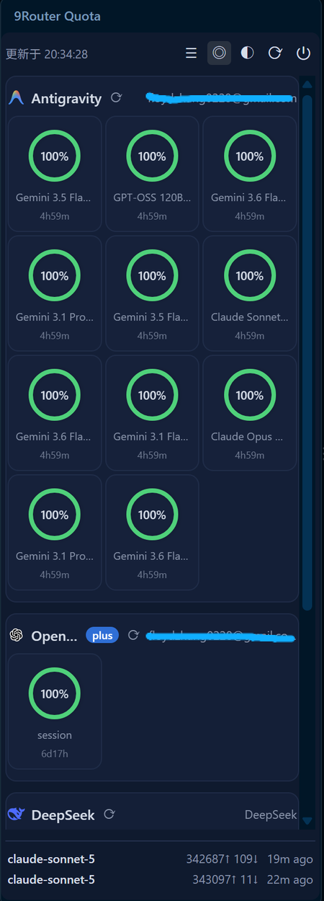

# 9Router Quota

在VSCode里查看 [9Router](https://github.com/decolua/9router) 各AI账号配额用量的客户端扩展。支持Claude、OpenAI、Gemini、DeepSeek、GLM、Kimi等19家供应商。

<!-- 保持相对路径：GitHub上直接显示；打包时vsce按package.json里的 --baseImagesUrl
     重写成raw.githubusercontent.com绝对地址。不能内联成data URI —— VSCode 1.104
     起扩展详情页的Markdown消毒器只放行http/https的src，data: 图片会被剥成裂图。
     图片已按展示尺寸450px宽存盘，无需width属性。 -->
## 运行截图

登录页：

侧边栏面板 · 列表视图（进度条 + 剩余百分比 + 重置倒计时，底部为实时最近请求）：

侧边栏面板 · 圆环视图（同一份数据的紧凑排布，适合配额条目较多时速览）：

## 功能特性

- **侧边栏面板**：分组卡片展示各账号配额，列表 / 圆环双视图切换。
- **状态栏指示**：右下角常驻 `9` 图标，悬浮显示配额摘要，每5分钟自动刷新。
- **实时最近请求**：面板底部通过SSE长连接推送最近两条请求（模型、输入/输出token、相对时间）。
- **单账号刷新**：每个账号卡片带独立刷新按钮，可单独重拉。
- **主题切换**：深色 / 浅色 / 跟随系统三档循环，首次启动默认跟随系统，手动切换后偏好跨会话保留。
- **余额型配额直读**：DeepSeek等信用池账号直接显示真实余额而非百分比。

## 快速开始

1. 点击左侧活动栏的 `9` 图标打开面板。
2. 填入9Router服务地址（如 `http://9router.example.com`）与Dashboard密码。
3. 密码仅存于VSCode本地凭据库（SecretStorage），不同步、不明文落盘。

## 设置项

| 配置 | 说明 |
| --- | --- |
| `9routerQuota.baseUrl` | 9Router服务地址，也可在面板登录时填写 |

## 前置条件

一个运行中的9Router服务实例及其Dashboard密码。服务端部署见 [decolua/9router](https://github.com/decolua/9router)。

## 许可

MIT。源码与开发文档见 [FloydZhang0228/9Router-Quota](https://github.com/FloydZhang0228/9Router-Quota)。
